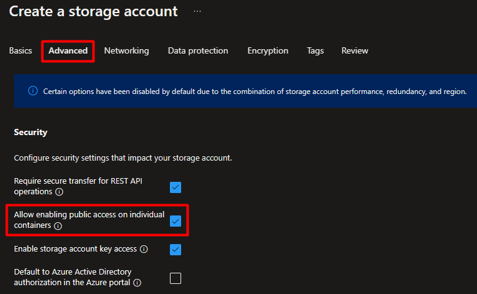
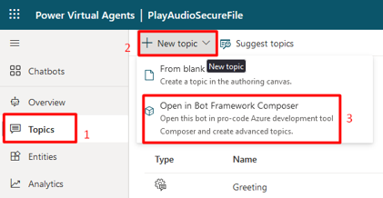

# Play secure audio file from PVA

For PVA customer voice solutions, if customer need to play their custom
audio clips that they play through their Interactive Voice Response
(IVR), they need to use secure storage.

This can be achieved with Azure Blob Storage but by default, Azure Blob
storage URL's contain values that are filtered out by security scanning
code when passed between systems.

Prerequisites
-   Have a custom PVA Bot,  [Sample PVA Bot solution](./sampleartifacts/PlaySecureAudioFilefromPVA_1_0_0_1.zip)
-   Create Azure Storage Account
-   Have a custom audio clip
-   Install Bot Framework Composer (Instructions) [here](https://learn.microsoft.com/en-us/composer/install-composer?tabs=windows)

## Solution

-   Utilize Azure Blob storage to host audio files for playback through SSML
-   Encode the URL's such that they meet content security scanrequirements for Microsoft systems.

## Steps to Create Storage Account and secure audio file:

1.  Provision or log in to your Azure account (sign-up [link](https://azure.microsoft.com/en-us/free/))
2.  Create an Azure Storage account
3.  When provisioning:
-   uncheck the box for **Allow enabling public access on individual containers** to ensure only URL's with secure access tokens are allowed

-   Leave the **Enable public access from all networks** selected

4.  Once created, create a blob storage container under **Containers**
5.  Upload audio files as blobs to the container
6.  Double click on an uploaded audio file row in container view, and navigate to **Generate SAS**
7.  Set an expiration time, and then choose **Generate SAS token and URL**.
8.  Copy the Blob SAS URL
9.  Before pasting into PVA, one additional step is needed which is to encode the URL; replacing all "&" characters with  "\&amp;"  will make it safe to pass through the PVA system

## Tips:
The **expiration time** will determine when the system will stop being able to play back this audio file; please be careful when choosing this datetime.

## Steps to use audio file from secure storage:

1.  Open your custom PVA in Bot Framework composer
2.  For this open your Bot in [Power Virtual Agents](https://web.preview.powerva.microsoft.com)
3.  Then go to Topics, New topic and finally Open in Bot Framework Composer

4.  Once Bot Framework Composer open, add a new dialog to your Bot.

5.  With the new dialog created click BeginDialog

6.  In the edit panel add a new event Send response

7.  Add speech component to your bot response. (Instructions [here](https://learn.microsoft.com/en-us/composer/concept-speech?tabs=v2x#add-speech-components-to-your-bot-responses))
8.  After choosing audio option, copy/past your secure URL generated above to the "URL" tag.

9.  Finally save and publish your PVA.
