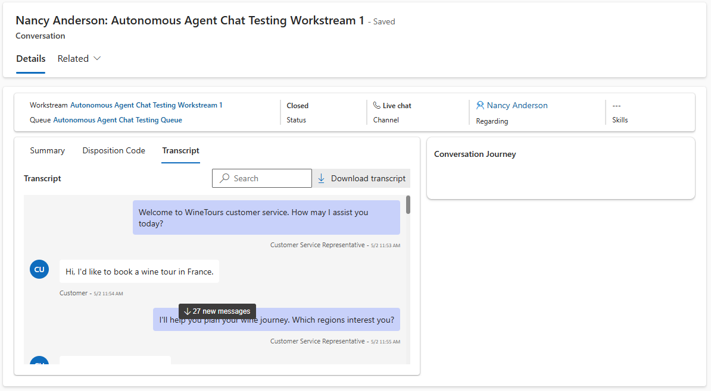
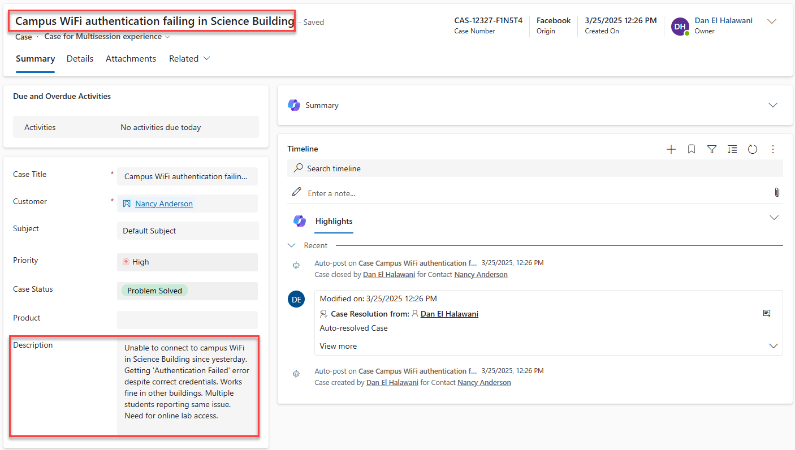

# Customer Service Data Generator

A tool for generating test data in Dynamics 365 Customer Service, specifically Cases and Conversations with Chat Transcripts. 

Cases can have non-AI generated fake Titles and Descriptions or leverage AI-generated Titles/Descriptions, with randomized Origins, Case Types, Priorities and a default user-set Customer. 

Conversations have AI-generated sample transcripts for over 1,000 unique chats across various industries, including Azure Support, Food Delivery and Rideshare Support, Shipping and Logistics Support, Retail Support, Banking Support, Hotel and Travel/Airline Support, University/College Support, and IT Helpdesk Support.


## Quick Start - Initial Setup

1. **Install Python 3.11.9** 

      Note: This app may not work with newer Python versions on systems without a full installation of Visual Studio (not Code) installed, so 3.11.9 is strongly recommended for most users of this app.

   - Download from [python.org](https://www.python.org/ftp/python/3.11.9/python-3.11.9-amd64.exe)
   - Make sure to check "Add Python to PATH" during installation

2. **Run the setup script**

    Extract the ZIP file to a directory on your computer. Open Windows Explorer to the directory you have the extracted files located. 
    
    In Windows 11, right click in that CustomerServiceDataGenerator directory and click Open in Terminal. In previous versions of Windows, open a Command Prompt and navigate to the CustomerServiceDataGenerator folder using cd and the path. For example, for pre-Windows 11 computers:

    ```bash
    cd C:\Users\your_username\Downloads\CustomerServiceDataGenerator
    ```

   Then run the following command:

   ```bash
   python setup.py
   ```

3. **Install required packages**
    
    In the same Terminal window, run the below commands next.
   
   ```bash
   pip install --only-binary :all: numpy
   ```

   This next command may take a few minutes to complete, so please be patient.

   ```bash
   pip install -r requirements.txt
   ```
   (*If you have a newer version of Python installed than 3.11.9 this above step may fail if you don't have other Visual Studio-related build tools installed - you can always install 3.11.9 even if you have a newer version installed. Then run the below command instead to target 3.11:*)
   ```bash
   py -3.11 -m pip install -r requirements.txt
   ```

4. **Run the app**
   
   To run the app, simply run the below command. 

   ```bash
   python -m streamlit run app.py
   ```

   (*Again, if you hit errors running the above command, run the below one to ensure Python 3.11 used*)

   ```bash
   py -3.11 -m streamlit run app.py
   ```
   
   The first time you run it, you will be prompted for an Email Address - you do not have to submit one, simply hit Enter.

   
   
   You may also be prompted if you want to let Python communicate over your network the first time as well, click Allow to allow it to run properly, and you should not be prompted for these items again after initial setup.

   
   
   Next time you want to run it, simply re-open a Terminal window in your folder and run the below command. The app will open in your browser. When you're done, simply close the browser app window and Terminal.

## Running the App

To run the app again later, reopening it in your browser, simply open Windows Explorer to the directory you have the extracted files located. Right click in that directory and click Open in Terminal. Then run the below command.

   ```bash
   python -m streamlit run app.py
   ```

(*Again, if you hit errors running the above command, run the below one to ensure Python 3.11 used*)

   ```bash
   py -3.11 -m streamlit run app.py
   ```

### Getting Your D365 Cookie

1. Open your D365 instance in Chrome/Edge
2. Press F12 to open Developer Tools
3. Go to the Network tab
4. Refresh the page
5. Click on any request
6. In the Headers section, find "Cookie"
7. Copy the entire cookie string

   

### Permissions Required
Your user must have full permissions for Cases (`incident`), Conversations (`msdyn_ocliveworkitem`), Notes (`annotations`), and Transcripts (`msdyn_transcript`). In addition your user must have read for Subjects (`subject`) and read/append for Contacts (`contact`).

### Getting a Customer ID
For Case Generation, you will need a contactid for the app to set on all generated Cases. Simply open your Contact of choice in your target environment, copy the contactid GUID from the URL or via the Share button URL, and paste that into the appropriate field.

For Conversation Generation, it is recommended you populate a contactid for best data quality, however, it is not required and can be blank.

### Getting a Workstream ID and Queue ID
For Conversation/Transcript Generation, you will need a Workstream ID and Queue ID. To get your Workstream ID, use the Customer Service Admin Center (CSAC) app to navigate to your Workstreams, pick your one of choice (ideally a Chat-based one for consistency but any type of Workstream should work), and grab the GUID from the end of the URL in your browser. Similarly, for Queue ID, navigate to an Advanced Queue of choice in CSAC and copy the GUID from the end of the URL. Remember that GUIDs are like so: `00000000-0000-0000-0000-000000000000`.

### Randomize Created On Date

The sidebar includes a field labeled "Randomize Created On (Last X Days)". This setting allows you to control the `createdon` timestamp for generated Cases and Conversations/Transcripts.

-   Enter a number `X` to have the `createdon` date set to a random date and time within the last `X` days.
-   Setting the value to `0` (the default) means the records will be created with the current date and time.
-   This setting affects both Case Generation and Conversation/Transcript Generation. When generating records with randomized past dates, the system ensures that related records (like a Case and its resolution, or a Conversation and its Transcript/Annotations) maintain logical chronological order (e.g., a case resolution date will always be after its creation date).

## Conversation and Transcript Generation

This tool will generate Conversation records with Transcripts of chat conversations that are pre-generated by AI in JSON files. A number of sample files are included with this tool and are detailed below. The Conversation records will be Closed after generation, and can be viewed in the D365 UI as normal.



### Sample Conversation Transcripts

The repository includes over 1,000 sample transcripts for various industries:
- Retail Support (100+)
- IT Helpdesk (100+)
- Banking Services (100+)
- Hotel/Travel/Airline (100+)
- Logistics/Shipping (100+)
- Food/Rideshare (200+)
- Azure Support (300+)
- University/College (100+)

### Generating Your Own Conversation Transcript Files

You can simply use the sample transcripts provided and not generate any of your own for fastest usage, however, should you want to generate other industry transcripts, you can use the following guidance. The transcript JSON files should follow one of these formats if you choose to generate your own via your AI tool/model of choice - the 1,000+ sample transcripts included were generated with the following prompt primarily via claude-3.7-sonnet for most realistic and detailed chats, but the prompt itself can be used against any model, including being used in the M365 Copilot app/site itself, although quality of conversations may be an issue. The prompt itself can be used against any LLM, including in Azure AI Foundry and elsewhere - trial and error may be needed to generate the best conversations. When using claude-3.7-sonnet to generate the sample transcripts included, it is worth noting that the quality of conversations was very high, but each set of 100 took upwards of 30-45 minutes to generate, sometimes needing to be restarted along the way due to the intensity of the generation.

### Prompt Format Used
```
I need you to create a new JSON file for transcripts of Hotel, Travel, and Airline chats. These can be about account issues, booking issues, trip needs, cancellation needs, additional guests, reservation questions, amenities questions, quality issues, flight delays, overcharges, discounts, schedule change requests, and other travel, hotel, and airline customer needs. You MUST make sure each transcript is unique and not repetitive. You MUST ensure that each transcript has at least 15 back and forth messages, some having 20, some 25, some 30, etc. Make sure each transcript sounds realistic. Sometimes you can have customers being frustrated, sometimes you can have customers being pleased, but never use profanity. The company name can be varied and different for each chat, with minimal repetitions.

You MUST create 100 of these unique transcripts. DO NOT stop until you have created 100 of them. When you create a new transcript, do not modify it, just keep adding new transcripts to the file. Make sure that at the end of this, we have 100 unique banking related transcripts per all the instructions above.

You must use the following output format:
[
  {
    "transcript": "agent - Hello, how can I help you today? || customer - I need help with my account"
  }
]
```

In the prompt above, you'll want to adjust the industry specific terms and phrases accordingly for your own needs.

### Conversation Transcript Output Format

```json
[
  {
    "transcript": "agent - Hello, how can I help you today? || customer - I need help with my account"
  }
]
```

## Case Generation

The tool offers two methods for generating cases in your Dynamics 365 Customer Service environment, specific to the Title (`title`) and Description (`description`) fields. For both options, Priority (`prioritycode`), Case Type (`casetypecode`), and Origin (`caseorigincode`) are randomized (`CASE_ORIGIN_CODES` in `case_generator.py` is set to default values - be sure to check this line should you have custom values to add or default values you've deleted from your environment). Customer (`customerid`) is hardcoded to the Contact (`contact`) you set when running Case Generation. A random Subject (`subjectid`) is automatically pulled from your environment and populated. Cases are Resolved after batch creation automatically for digestion in downstream Copilot Autonomous Agent and analytics use cases.

### Randomized Case Generation

This option creates cases with automatically generated content that is not from AI:
- Randomized realistic titles following common support issue patterns
- Detailed descriptions with problem specifics, technical details, and steps to reproduce
- Random priorities and origins assigned to each case
- Environment-specific details included in descriptions
- Cases are automatically created and then closed after creation
- Configurable batch sizes and total record count


### Predefined Case Data

For more controlled test data, you can use predefined case content generated by AI via JSON files similar to Conversations/Transcripts:
- Uses pre-created case titles and descriptions from the included case_data.json file
- Over 1,200 realistic case scenarios across multiple industries and issue types
- More realistic and human-like case content than auto-generated options
- Ideal for demos, training, and testing specific support scenarios
- Ensures consistency between test environments



To choose your preferred generation method, simply select the corresponding option in the Cases tab of the application.

## What's Included

This tool includes two main scripts:

1. **Case Generator** (`case_generator.py`)
   - Creates realistic customer service cases
   - Generates 1000 cases by default (configurable)
   - Includes random titles, descriptions, and attributes
   - Automatically closes cases after creation

2. **Transcript Generator** (`conversation_transcript_generator.py`)
   - Processes chat conversations from JSON files
   - Creates live work items and transcripts
   - Supports multiple industry scenarios
   - Includes sample transcripts

3. **Simple User Interface** (`app.py`)
    - Allows users to simply run the logic as needed without extra need to run scripts directly.

## Troubleshooting

### Performance Considerations

- Both scripts use concurrent processing to improve performance
- Default batch sizes should set between 10 and 100 records - if using 100 and you receive 429s from Dataverse, lower batch sizes and re-run
- Adjust Batch sizes based on your environment's capabilities
- Monitor API rate limits and adjust batch sizes accordingly

### Error Handling

- The scripts include comprehensive error handling and logging
- Failed operations are logged to the console with timestamps
- Processing continues even if individual records fail
- Each file is processed independently, so failures in one file won't affect others

### Common Issues

1. **Python not found**
   - Make sure Python is installed and added to PATH
   - Try running `python --version` to verify

2. **Package installation fails**
   - Try upgrading pip: `python -m pip install --upgrade pip`
   - Install packages one by one if needed

3. **Authentication errors**
   - Verify your cookie is valid and not expired
   - Check your D365 permissions

4. **Rate limiting and 429 Errors**
   - Reduce batch sizes in config.json