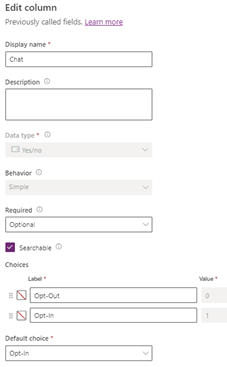
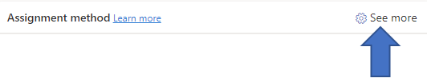
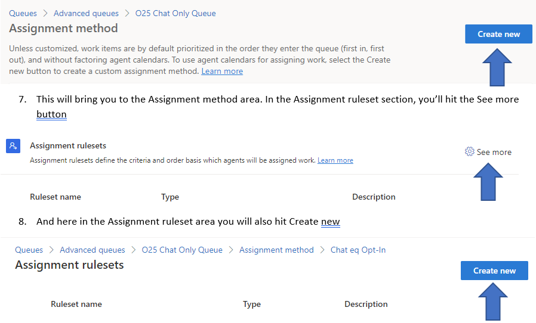
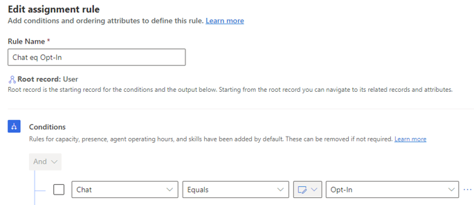
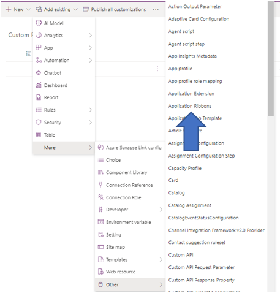
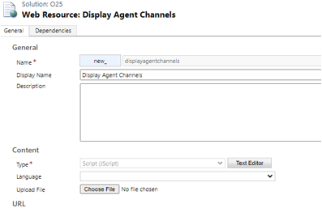
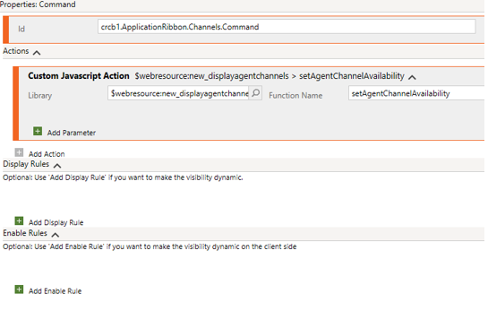
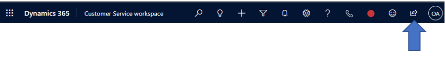

# Channel Based Presence

## Recommended Approach

The recommended approach is to utilize a Channel-centric solution by setting up a separate Advanced Queue for each relevant Channel. This allows for the use of the native Assignment MethodAssignment Ruleset functionality and reduces latency between Agent Channel selection and assignments.

## Use Case Definition

For this example we will set up three Channels; Chat, Voice, Case. Users will be enabled to set their presence to accept a combination of Channels at which point the appropriate items will be routed to the agent based on their selections e.g. if a User selects Chat and Case, that User will only receive live incoming Chats and Cases.

## Update User Record & Security

The following items, in the User Record & Security section are contained within the 'Channel Based Presence' solution.

1. Navigate to PowerApps and create a new solution for User customizations.
2. Add 3 new Boolean field to the User entity (Chat, Voice, Case)
  a. For all fields, set the Default Value = Opt-In



3. Create a custom User Form that only shows these three fields


4. Security Options – there are multiple layers within Dynamics security to ensure Users only have the required access.
  a. Create a custom Security Role (Best Practice is to copy from one of the out-of-box Security Roles) for 'Agent Channel Presence' that with no specific permissions contained within.
  b. Navigate to the User Entity, create a custom form with only the newly created fields listed above.
  c. Click 'Enable Security Roles' and enable the newly created 'Agent Channel Presence' security role (as well as System Admin, Supervisor etc roles as needed)
  d. _**Note: (not contained within the 'Channel Based Presence' Solution)**_ within the Customer Service workspace Model Driven App, ensure that the only User form available is your newly created User Form mentioned above.
  e. _**Note: (not contained within the 'Channel Based Presence' Solution)**_ In order to ensure your Customer Service Agents are not able to edit any other elements of the User record, you could optionally also 'Enable Security Roles' on all other User Forms and ensure that the 'Agent Channel Presence' Security Role as well as the other Roles your Customer Service Agents are assigned, are un-checked so as to disable all other User Forms for your Customer Service Agents
  f. _**Note: (not contained within the 'Channel Based Presence' Solution)**_ As an additional measure of security, you do have the option to enable field level security for all of the fields on the User Entity except for the newly created Boolean fields listed above.

## Create Channels

### Chat Channel

1. Navigate to Customer Service admin center app to the Customer Support Channels to the Chat Channel
2. Create new Channel
  a. Channel details – _Note at this point, you will be asked to name and create the associated Workstream._


  b. Chat Widget


  c. Behaviors


  d. User features


**Note** : _If you have not set-up your Workstreams yet, do so at this point so that you can associated your Channels with the appropriate Workstreams._

  e. Repeat the Channel and Workstream setups for the other channels, in this example that would be Voice and Case.

## Advanced Queues & Routing

1. In the Customer Service admin center, navigate to Customer supportQueuesAdvanced Queues and click Manage


2. Click the New queue button to create your new queue.


3. Follow the prompts to create your new queue (Name, Type = Voice, messaging, record) and Group Number.
4. Once your Queue is created you'll be required to add Users to the Queue. Add all relevant Customer Service Agent Users to this Queue.
5. Click on the 'See more' option in the 'Assignment method' section



6. Click the 'Create new' button. This will bring you to the Assignment method area. In the Assignment ruleset section, you'll hit the See more button. And here in the Assignment ruleset area you will also hit Create new



9. Name your new Assignment ruleset (something like Chat Opt-In).
10. While editing this new Assignment rule, under the Conditions section, select your newly created Chat Boolean field (on the User record) and make it Equals – Opt-In.



11. You will Save & Close this newly created Assignment ruleset and repeat this activity for each of your newly created Channels so that there is a unique Advanced QueueAssignment methodAssignment rulesetAssignment rule for each of your Channels (in our example, Voice and Case)

## Model Driven App Custom Button

In order to allow individual Users to access the custom User form with the newly created custom Channel selection fields (Chat, Voice, Case, etc) we have created a custom button to be deployed within the model-driven app 'Customer Service workspace'.

Note: A Prerequisite for adding the custom button is XrmToolBox which can be downloaded from GitHub here ([XrmToolBox](https://github.com/MscrmTools/XrmToolBox)). Once you have installed XrmToolBox, you'll search for the Ribbon Workbench Tool and ensure that it has been installed in your instance of XrmToolBox.

1. When modifying a ribbon, it is recommended to take a backup of the out-of-the box ribbon. To do say, create a new solution 'Custom Ribbon', click 'Add Existing'Application Ribbons to add your native Application Ribbon.

**Note:** _Best practice is to Export this solution with the out-of-the box ribbon as a backup. In addition, this should be deployed in a DEV environment first to be able to properly test the desired functionality._

 

2. _**(The following Web Resource file is contained in the 'Channel Based Presence Capability' Solution)**_ In your Solution, create a new Web Resource component of Type = Script.



3. Click the Text Editor button to add the javascript below.  

```javascript
function setAgentChannelAvailability()

{

var userSettings = Xrm.Utility.getGlobalContext().userSettings;

var pageInput = {

pageType: "entityrecord",

entityName: "systemuser",

entityId: userSettings.userId,

formId: "4a3294ca-3132-ec11-b6e5-00224808de9e"

};

var navigationOptions = {

target: 2,

height: {value: 80, unit:"%"},

width: {value: 25, unit:"%"},

position: 2

};

Xrm.Navigation.navigateTo(pageInput, navigationOptions).then(

function success() {

// Run code on success

},

function error() {

// Handle errors

}

);

}
```
4. Within XrmToolBox, Connect to your environment, click the 'Open Solution' button within the Ribbon Workbench tool and select your newly created 'Custom Ribbon' solution.

Note: **(The following Application Ribbon file is contained in the 'Channel Based Presence Capability' Solution. If you have already modified your Ribbon, utilize the alternate Solution available 'Channel Based Presence Capability – No Application Ribbon' )**_

5. Here you will add a custom button to the main ribbon. The button setup should look like the following:


6. The Commands for the button should reference our newly created Web Resource file as follows:



7. In the Ribbon Workbench tool, click the 'Publish' button at the top to deploy your newly created button.
8. The modified ribbon should look like the following, with your newly created button



9. When you click this button, you should see the newly created User form with your newly created buttons.


10. The User will then be able to select which items to Opt-In or Opt-Out of and the previously configured Assignment rulesets will reference these selected items when deciding to whom to route the Chat, Voice, or Case records.

# Appendix – Solution Components

## Channel Based Presence Capability Solution Components

 **Note: There is a Managed and Unmanaged version available.** 

- User Entity
  - Agent Channel – custom form
  - Case (new\_casechannel) – custom Boolean field
  - Chat (new\_chatchannel) – custom Boolean field
  - Voice (new\_phonecallchannel) – custom Boolean field
- Display Agent Channels (new\_displayagentchannels) – custom Web Resource file containing the aforementioned javascript.
- Agent Channel Presence – custom Security Role assigned to the Agent Channel custom form.
- Application Ribbons – out of the box Ribbon containing the custom button.

## Channel Based Presence Capability-No Application Ribbon Solution Components

 **Note: There is a Managed and Unmanaged version available. If you have already made modifications to your Application Ribbon, you'll want to utilize this solution and manually modify your ribbon per the instructions above.** 

- User Entity
  - Agent Channel – custom form
  - Case (new\_casechannel) – custom Boolean field
  - Chat (new\_chatchannel) – custom Boolean field
  - Voice (new\_phonecallchannel) – custom Boolean field
- Display Agent Channels (new\_displayagentchannels) – custom Web Resource file containing the aforementioned javascript.
- Agent Channel Presence – custom Security Role assigned to the Agent Channel custom form.
