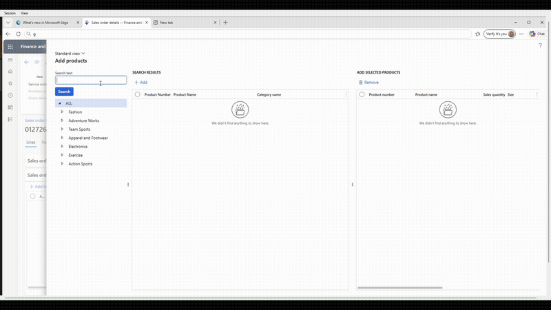
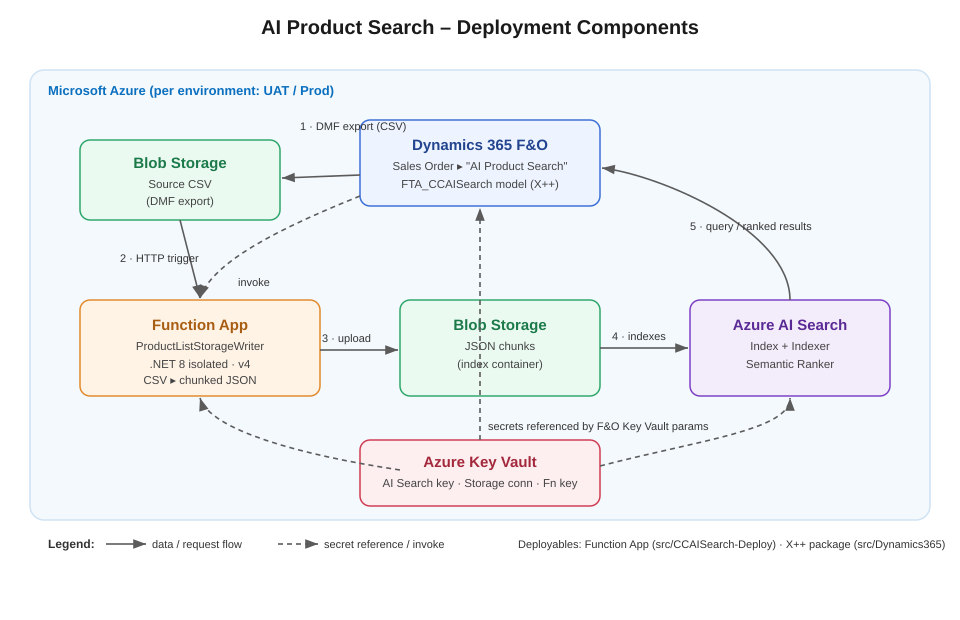

# CCAISearch – Azure AI Search for Item Search in Dynamics 365 F&O

Enhance item retrieval in **Dynamics 365 Finance & Operations** sales order creation by
replacing the standard SQL-based lookup with **Azure AI Search** and its *Semantic Ranker*.
This delivers faster, more accurate, natural-language product search while reducing load on
the ERP database.

> Developed by the **Microsoft FastTrack** team. See the [Disclaimer](#disclaimer).

> [!IMPORTANT]
> This README always describes the **latest release** (currently **V7-20260815**).
> If you are running an **older deployment package**, check out the matching Git tag on the
> [Releases][releases] page to view the documentation as it was for that version, or read
> [`CHANGELOG.md`](CHANGELOG.md) to see what has changed since your version.

---

## Table of contents

- [Overview](#overview)
- [Architecture](#architecture)
- [Get started](#get-started)
- [Downloads](#downloads)
- [Repository structure](#repository-structure)
- [Disclaimer](#disclaimer)
- [License](#license)

---

## Overview

**Next-Generation Product Search Powered by Azure AI**

The standard item search in Dynamics 365 Finance & Operations is SQL-based keyword matching.
With large product catalogs, this degrades search performance and user experience.

This solution replaces **SQL-based product search in Dynamics 365** with **Azure AI Search's semantic ranking**, delivering:

- **Faster discovery** — employees find products in seconds, even in large catalogs
- **Intelligent matching** — understands natural language, handles typos, synonyms and
  conceptual matches
- **Reduced ERP load** — search no longer burdens the database; all queries hit Azure AI Search
- **Enterprise-grade** — fully managed, secure, scalable, with document-level access control

## Architecture

### How it works

1. **Data Export** – Dynamics 365 product master data is exported as CSV (via DMF) to Azure Blob
   Storage.
2. **Data Transformation** – The **Function App** (`ProductListStorageWriter`) is triggered,
   downloads the CSV, parses it into records, and uploads them as JSON chunks to a destination
   blob container. It receives only the storage **endpoint URL** from D365 and authenticates to
   storage with its own **managed identity** — no storage key or connection string is sent or
   stored on the function.
3. **Indexing** – **Azure AI Search** discovers and indexes the JSON chunks in near-real-time,
   building a searchable product index with semantic ranking enabled.
4. **Search** – Users search on the D365 Sales Order form; the X++ form extension queries the
   Azure AI Search index directly (no SQL on the ERP), retrieves ranked results, and displays them.
5. **Security** – Secrets (AI Search key, Storage connection string, Function key) are stored in
   **Azure Key Vault** and referenced via D365 Key Vault parameters. D365 extracts only the blob
   **endpoint URL** from the storage connection string and passes that non-secret value to the
   Function App, which writes to storage using its **managed identity** (Storage Blob Data
   Contributor). The storage account key is never transmitted between components.

### Technology stack

| Component | Technology | Purpose |
|---|---|---|
| **Cloud indexing** | Azure AI Search (Semantic Ranker) | Semantic search, re-ranking, NLP |
| **Data storage** | Azure Blob Storage | CSV source + JSON index data |
| **Transformation** | .NET 8 Azure Function (isolated) | CSV ▸ JSON chunking + upload |
| **Secrets mgmt** | Azure Key Vault | Secure credential storage |
| **UI Integration** | Dynamics 365 X++ (FTA model) | Sales Order search form extension |

## Repository structure

| Component | Location | Type | Deploy method |
|---|---|---|---|
| **Function App code & deployment** | `src/CCAISearch-Deploy/` | .NET 8 C# | See [Azure setup](docs/azure-setup.md) Step 4 |
| **D365 X++ source & deployment** | `src/Dynamics365/` | X++/XML | See [Dynamics 365 Model Deployment](docs/fno-model-deployment.md) |
| **Azure resources** | n/a | Azure | See [Azure setup](docs/azure-setup.md) Steps 1–3, 5–7 |
| **Configuration** | n/a | D365 forms | See [F&O configuration](docs/fno-configuration.md) |

## Get started

Follow these guides **in order** to deploy the solution:

1. **[Azure setup](docs/azure-setup.md)** – Provision Resource Group, Azure AI Search, Storage,
   Function App, Key Vault. Takes ~15 min.
2. **[Dynamics 365 Model Deployment](docs/fno-model-deployment.md)** – Import and deploy the X++ model package.
   Takes ~5 min.
3. **[F&O configuration](docs/fno-configuration.md)** – Configure Key Vault parameters, AI Search
   index, and Sales Order form extension. Takes ~10 min.

---

## Downloads

All deployment packages are available in the [`src/`][releases] folder of this repository:

- **Function App deployment package** – `CCAISearch-Deploy-v1.0.zip` (.NET 8 source code)
- **Dynamics 365 model package** – `FTA_CCAISearch_V7_20260815.axpp` (pre-built X++ model)

> Each release includes **both** artifacts. Always deploy the Function App package and the
> D365 model package from the **same release** to keep the two sides in sync.

See the deployment guides for instructions on how to use each package.

---

## Disclaimer

This solution is developed by the **Microsoft FastTrack** team. It is **not** covered under
product warranty and is **outside the scope of D365 support services**.

- Test thoroughly before deploying to production. If issues occur in production, disable the
  feature from the **Azure AI Search parameters** form.
- Use **separate** Azure AI Search instances for Production and UAT — the environments may
  hold different data.
- The same approach can be extended to customer or order search.
- Index only the fields you need; too many fields slows response times.

## License

Released under the [MIT License](LICENSE).

<!-- Link shortcuts - update here if URLs change -->
[releases]: src
