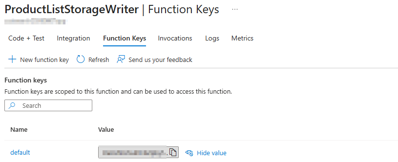

# Azure setup

Step-by-step provisioning of the Azure resources required by the CCAISearch solution. Perform
these steps once **per environment** (e.g. UAT and Production should have separate services to
avoid data corruption).

## Assumptions and working methodology

- Product search uses **Item ID** as the key. Keys may contain letters, digits, underscores
  (`_`), dashes (`-`) or equals (`=`), but **no spaces**.
- **Index strategy**: Create a separate index per legal entity (recommended). You can optionally
  reuse a single index across legal entities, but ensure the combined dataset size fits your
  AI Search tier.
- Provision a **separate Azure AI Search service per environment** (Production and UAT must not
  share data).
- Choose the AI Search pricing tier based on the number of indexes and the volume of exported
  data.

Throughout this guide, values you must copy for later are marked like `#SecretName`.

---

## Step 1 – Resource Group

1. Sign in to the [Azure portal](https://portal.azure.com).
2. Create a new **Resource Group**: choose your subscription, a meaningful name and the
   appropriate region, then **Review + create**.

## Step 2 – Azure AI Search

Azure AI Search loads and indexes the exported data and returns ranked results.

1. In the Resource Group, **Create a resource** ▸ **Azure AI Search**.
2. Select the Resource Group created in Step 1.
3. **Change Pricing Tier** to a tier that supports your index count / data volume.
   > The **Semantic Ranker** must be enabled (available from the Standard tier). It uses
   > neural networks for relevance and handles typos, synonyms and conceptual matches.
4. Configure Scale and other options, then **Review + create** ▸ **Create**.
5. Copy the service endpoint from **Overview ▸ Essentials ▸ URL** as `#AISearchServiceEndpoint`
   (e.g., `https://<service-name>.search.windows.net/`).
6. Copy the admin key from **Settings ▸ Keys ▸ primary admin key** as `#AzureAISearchAccessKey`.

## Step 3 – Storage Account

Cloud storage holds the master data that AI Search indexes, enabling independent, incremental,
periodic updates from the ERP.

1. **Create a resource** ▸ search **Storage account** ▸ **Create**.
2. Select the same Resource Group, enter a meaningful name, complete required fields, then
   **Review + create**.
3. Copy the connection string from **Security + networking ▸ Access keys ▸ key1 ▸ Connection
   string** as `#StorageAccountConnectionString`
   (format: `DefaultEndpointsProtocol=https;AccountName=...;AccountKey=...;EndpointSuffix=core.windows.net`).

## Step 4 – Deploy the Function App

The Function App (.NET 8 isolated-worker) transforms CSV product data into JSON chunks indexed by Azure AI Search.

### Prerequisites

- [Visual Studio Code](https://code.visualstudio.com/) with the
  [Azure Functions extension](https://marketplace.visualstudio.com/items?itemName=ms-azuretools.vscode-azurefunctions)
- [.NET 8 SDK](https://dotnet.microsoft.com/download/dotnet/8.0)
- An active Azure subscription with **Contributor** or **Owner** permissions on the
  Resource Group from Step 1

### Step 4a – Create the Function App in Azure Portal

Creating the Function App in the portal first ensures your permissions are correct and avoids naming conflicts.

1. Sign in to the [Azure portal](https://portal.azure.com).
2. Click **Create a resource** ▸ search for **Function App** ▸ **Create**.
3. Fill in the details:
   - **Subscription**: Select your subscription
   - **Resource Group**: Select the group from Step 1
   - **Function App name**: Enter a globally unique name (e.g., `ccaisearch-prod-001`)
     > Naming rules: lowercase, digits, hyphens only; 3–24 characters; must be unique across Azure
   - **Runtime stack**: **.NET** (Isolated)
   - **Runtime version**: **8.0**
   - **Region**: Same as your Resource Group
   - **Storage Account**: Select the account from Step 3
     > Azure Function Apps require a storage account for runtime infrastructure (logs, metadata, state).
     > We reuse the one from Step 3, which also holds your CSV source data and JSON chunks.
4. Click **Review + create** ▸ **Create**. Wait ~2 minutes for provisioning to complete.

**If naming fails:** The portal will show you the exact reason (e.g., name taken, permissions). Fix it and retry.

### Step 4b – Deploy Code via VS Code

Now deploy the Function App code to the resource you just created.

1. **Prepare the code folder:**
   - If cloned: Open `src/CCAISearch-Deploy` in VS Code
   - If downloaded zip: Extract `CCAISearch-Deploy-v1.0.zip` and open the extracted folder in VS Code

2. In VS Code, press `Ctrl+Shift+P` ▸ **Azure Functions: Deploy to Function App…**

3. Follow the prompts:
   - Sign in to Azure if prompted
   - Select your subscription
   - Select the Function App you created in Step 4a
   - Confirm the deployment

4. Deployment takes ~30 seconds. When complete, you'll see a success message.

### Retrieve the endpoint and key

After successful deployment:

5. In the Azure portal, open the deployed Function App ▸ **Functions ▸ ProductListStorageWriter
   ▸ Get function URL**.
   Copy the **base URL only** (without any `?code=…` query string) as `#DataUploadAzureFunctionEndpoint`
   (e.g., `https://<app>.azurewebsites.net/api/ProductListStorageWriter`).

6. To get the access key, go to **Functions ▸ ProductListStorageWriter ▸ Function Keys** tab.
   Copy the **default** key value as `#DataUploadAzureFunctionAccessKey`.

   

   > **Note:** The key in the "Get function URL" dialog is the same `default` key, but copying
   > it from the **Function Keys** tab is clearer and avoids confusing the endpoint URL with
   > the key parameter.

### Function contract reference

The function accepts HTTP POST requests (function-level auth) with this body:

```json
{
  "sourceBlobUrl": "https://<account>.blob.core.windows.net/<container>/products.csv?<sas>",
  "destinationConnectionString": "https://<account>.blob.core.windows.net",
  "destinationContainer": "products-index",
  "separator": "|",
  "recordsPerFile": 1000,
  "baseFileName": "s",
  "resetContainer": "true"
}
```

| Field | Required | Default | Description |
| --- | --- | --- | --- |
| `sourceBlobUrl` | ✅ | – | URL (with SAS if private) of the source CSV |
| `destinationConnectionString` | ✅ | – | Blob **endpoint URL** of the destination storage account (e.g. `https://<account>.blob.core.windows.net`). **Not** a secret — D365 parses it out of the stored connection string; the account key is never sent |
| `destinationContainer` | ✅ | – | Blob container that AI Search indexes |
| `separator` | ❌ | `,` | CSV column separator (use `\|` for VerticalBarSeparated) |
| `recordsPerFile` | ❌ | `1000` | Records per JSON chunk |
| `baseFileName` | ❌ | `s` | Prefix for generated JSON files |
| `resetContainer` | ❌ | `false` | `"true"` deletes existing blobs before upload |

Response: `200 OK` with message `Successfully processed and uploaded JSON files.`

> **Security — storage credential.** The storage **account key is never transmitted**. D365 reads
> the connection string from Key Vault, extracts only the blob **endpoint URL**, and sends that
> (non-secret) URL in the `destinationConnectionString` field. The Function App then authenticates
> to storage using its own **managed identity** — no key or connection string is stored on the
> function or carried in logs/telemetry.

### Configure managed-identity access to the destination storage

> **New in V7-20260815.** As of release **V7-20260815**, the Function App writes to storage using
> its **managed identity** (no storage key is sent from D365). Complete the steps below as part of
> deploying V7-20260815.

1. In the Function App, enable a **system-assigned managed identity**
   (**Settings ▸ Identity ▸ System assigned ▸ Status = On**).
2. On the **destination Storage account ▸ Access control (IAM) ▸ Add role assignment**, assign
   **Storage Blob Data Contributor** to the Function App's managed identity, then **Review + assign**.
   > This requires **Owner** or **User Access Administrator** on the storage account (or its
   > resource group). If **Add role assignment** is greyed out, ask your Azure administrator to
   > make this one assignment.
3. No storage app setting is required on the Function App — the endpoint arrives in each request
   and the managed identity provides access.

## Step 5 – App Registration (for Key Vault access)

1. Azure portal ▸ **App registrations** ▸ **New registration**. Give it a name and register.
2. Open the app ▸ **Manage ▸ Certificates & secrets ▸ New client secret**.
3. Record the secret **Value** and, from **Overview**, the **Application (client) ID**.

## Step 6 – Key Vault

1. Azure portal ▸ **Key Vault** ▸ **Create**, in the same Resource Group. Complete details,
   configure the security options, then **Review + create**.
2. **Go to resource ▸ Access control (IAM) ▸ Add ▸ Add role assignment**.
3. Role: **Key Vault Secrets User** ▸ **Next**.
4. **Select members** ▸ add the App Registration from Step 5 ▸ **Next ▸ Review + assign**.

## Step 7 – Store the secrets in Key Vault

Create four secrets in the Key Vault:

| Secret | Source |
| --- | --- |
| `#AISearchServiceEndpoint` | Step 2 |
| `#AzureAISearchAccessKey` | Step 2 |
| `#StorageAccountConnectionString` | Step 3 |
| `#DataUploadAzureFunctionAccessKey` | Step 4 |

---

Continue with **[Dynamics 365 Model Deployment](fno-model-deployment.md)** to deploy the model package.
