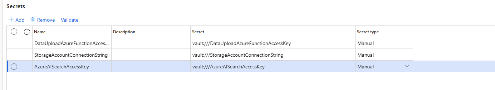
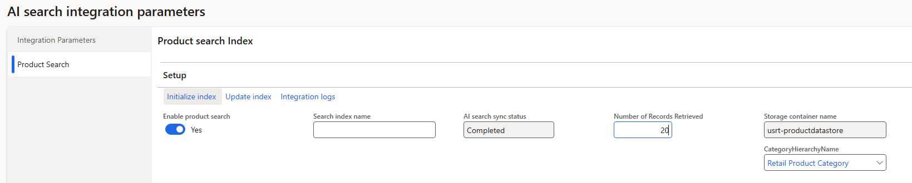

# Dynamics 365 Finance & Operations configuration

Complete the [Azure setup](azure-setup.md) first and have the `#…` values ready.

## Step 1 – Key Vault parameters

In D365 F&O, search for **Key Vault parameters** and create a new parameter:

1. Enter the **Key Vault URL** of the vault you created.
2. Provide the **client ID** and **client secret** from the App Registration (Step 5).
3. Add the three secrets created in Key Vault:
   - `#AzureAISearchAccessKey`
   - `#StorageAccountConnectionString`
   - `#DataUploadAzureFunctionAccessKey`
4. **Validate** each entry after inputting it.

## Step 2 – Azure AI Search integration setup

Go to **Sales and marketing ▸ Setup ▸ Azure AI Search ▸ Azure AI search parameters**.

### Integration Parameters tab

1. Enter the **AI Search endpoint** (copy the URI from the Azure AI Search resource) and select
   `AzureAISearchKey` from the dropdown.
2. Click **Validate endpoint** — it should verify successfully.
3. In the configuration section, select the **storage connection string** from the dropdown
   (one of the three secrets).
4. In **Data Upload Function Endpoint**, enter `#DataUploadAzureFunctionEndpoint`.
5. Select the **access key** for the data upload function (`#DataUploadAzureFunctionAccessKey`).
6. Choose the data export **source separator** — e.g. **VerticalBarSeparated** (`|`) used as the
   CSV column separator generated from DMF.
7. Click **Save**.

### Product Search tab

On the **Product Search** tab, configure the search index:

1. Enable **Enable Product Search** toggle — the feature only works when enabled.
2. Enter the **Search index name** (e.g., `fta-ccaisearch-products`) — this is the name of the
   AI Search index created during initialization (Step 3 below).
3. Set **Number of Records Retrieved** to control how many results are shown per search.
   - **⚠️ Important:** For best semantic search quality, keep this **≤ 50 records**. Higher values
     (e.g., 100+) may degrade relevance ranking as semantic similarity becomes less meaningful
     with large result sets. Start with 20–50 and adjust based on your use case.
4. Enter the **Storage container name** (e.g., `usrt-productdatastore`) — this is where the
   CSV product data is exported from D365.
5. Select the **Category Hierarchy** from the dropdown (e.g., **Retail Product Category**) — AI
   Search will only export products defined in this hierarchy.

## Step 3 – Initialize & update index

On the **Product Search** tab, click **Initialize index** to start the index creation process:

1. This creates a batch job that exports all product data from the selected **Category Hierarchy**
   and builds the AI Search index.
2. Monitor the job status — when complete, check **Integration logs** for any errors.
3. Once the index is successfully created (status shows **Completed**), schedule the recurring
   **Update Index** batch job to keep products in sync. This runs periodically to export
   incremental changes and reindex.

## Step 4 – Use product search on a Sales Order

1. Open a **Sales Order** and click the new **AI Product Search** button.
2. Enter search text and click **Search**.
3. Select a product and click **Add**. Repeat as needed; once items are selected and dimensions
   entered, click **OK** to add the products to the sales order lines.

---

See the [Disclaimer](../README.md#disclaimer) before using in production.
