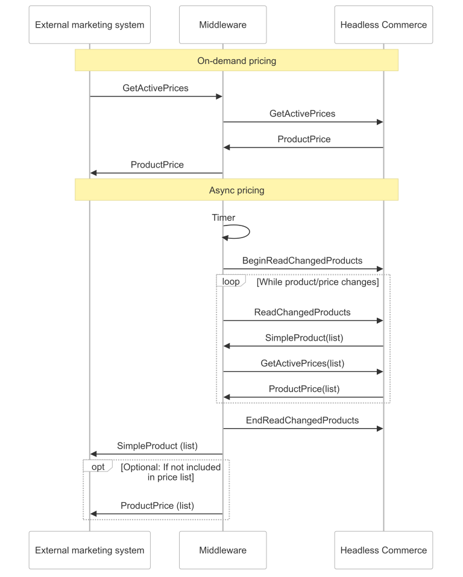

# Price and Discount Integration

## Synchronizing prices from Dynamics 365 with an external marketing platform
There are two primary patterns to use when integrating your external marketing system with Dynamics 365 Commerce.  The first pattern is on-demand (aka "real-time") integration (e.g., product detail page or search results/list page). The second pattern is asynchronous where a prices are fetched in bulk from Dynamics 365 Commerce and then stored in the external marketing platform.  Both patterns are illustrated in this diagram.

### On-demand price calculation
There are two flavors of on-demand pricing.  The first is **cart-based pricing** which considers the entire cart contents.  This allows for quantity, threshold (spend at least $X), and mix & and match (aka "buy one get one" BOGO) discounts as well as customer-specific and affiliation rules.  This pattern requires creating the entire cart in Headless Commerce in order for the price calculation to be accurate. <!-- Commented out until order page is published. Order and cart management is covered in the [orders](../orders/orders.overview.md) page. -->

#### CalculateSalesDocument
- **When to use**: `CalculateSalesDocument` accepts a `Cart` and returns a `Cart`. The prices and discounts calculated will consider product quantities and both single-line and multi-line discounts. The Cart object has many properties which can affect pricing. Customer, Loyalty, and Coupons to name a few.
- **Limitations**: The `Cart` object is complex. Using `CalculateSalesDocument` will require you to manage creating and parsing a Cart object. This can result in complicated data transformation code if the data model of the external marketing platform is significantly different from the data model in Dynamics 365 Commerce.

The second flavor of on-demand pricing is **individual product pricing**.  This is commonly used on product list pages, detail pages, and on price-checking apps/kiosks.  This happens outside the context of a cart or sales order, so it is unable to consider, quantity, threshold, or mix& match discounts in the price calculation.  It can consider "simple" discounts that only consider the individual product.  There are a few different APIs that could calculate product price.  The two that are relevant are `GetActivePrices` and `CalculateProductPrice`.

#### GetActivePrices
- **When to use**: `GetActivePrices` accepts a list of products and can do calculation in bulk.  It also accepts date parameter and could be used for calculating a future or historical price.  It also allows supports excluding simple discounts
- **Limitations**: `GetActivePrices` will only get the price for the default selling unit of measure (e.g., "each").  It is unable to calculate prices in terms of alternate units (e.g., "case").

#### CalculateProductPrice
- **When to use**: `CalculateProductPrice` accepts a list of products and can do calculation in bulk.  It also accepts date parameter and could be used for calculating a future or historical price.  
- **Limitations**: `CalculateProductPrice` will only get the price for the default selling unit of measure (e.g., "each").  It is unable to calculate prices in terms of alternate units (e.g., "case").

## Asynchronous pattern

### Dynamics 365 channel price list
You can view a channel price list in Dynamics 365 and you can generate it via batch. When generated via batch the output could be used as an import source price list to import into the external marketing platform.
1. Open the **All stores** or **Online stores** form and select your channel.
    - On the **Online stores** form; click on Channel >  Pricing > Price list > Price list (recommended) or run synchronously
    - On the **All stores** form; click Store > Pricing > Price list > Run as batch (recommended) or run synchronously

The channel price list has the following columns

- **Product number** - The Dynamics 365 product number
- **Product name** - String description
- **Currency** - Currency code. The channel's currency.
- **Price** - The sale price property from the released product.
- **Price adjustments** - A list of Price adjustment IDs that apply to this product.
- **Discounts** - A list of Discount IDs that apply to this product. 
- **Active price** - The calculated price with sales price trade agreements and commerce price adjustments applied.
- **Calculated discount** - The calculated discount taking into account only simple discounts. Doesn't include multi-item discount types; Mix & Match, Quantity, and Threshold.

Some or all of the Price adjustments and Discounts listed in the price list may not be applied to the price list's Active price and Calculated discount values. Two or more discount may compete and only the best one is applied or additional conditions may be needed to apply the price adjustment or discount. A coupon code for example.

#### Sample Price list output from demo data

| Product number | Product name | Currency | Price | Price adjustments | Discounts | Active price | Calculated discount |
| ---- | ---- | ---- | ---- | ---- | ---- | ---- | ---- |
| 0001  | Youth Accessory Combo Set | USD | 69.99 | | ST100024 | 69.99 | 0.00 |
| 0020  | Signature BMX Youth Helmet | USD | 29.99 | | ST100024 | 23.99 | 0.00 |

## Reference documents

- [Commerce pricing APIs](https://learn.microsoft.com/en-us/dynamics365/commerce/pricing-apis) This is a article that details out Commerce pricing APIs mentioned in this article as well as a few more.
- [Commerce Scale Unit customer and consumer APIs](https://learn.microsoft.com/en-us/dynamics365/commerce/dev-itpro/retail-server-customer-consumer-api) This article is a complete list of the public Commerce Scale Unit APIs.

