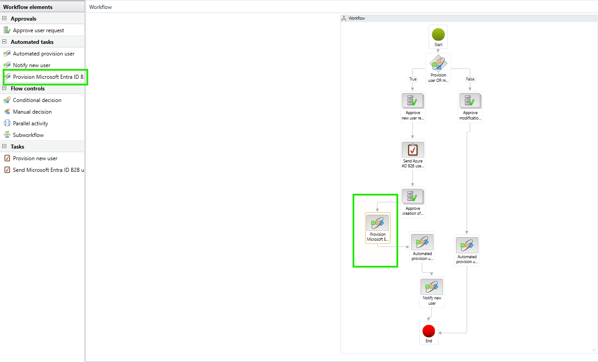

# Lab 3 of 9 — Configure Supplier Engagement in Supply Chain Management

*⏱ ~35 min · Configure*

Enable the Supplier Engagement feature, configure batch jobs, adjust security roles, turn on entity store refresh for risk reporting, set up the vendor user request workflow for portal access approval, and generate localization metadata. This is the SCM-side counterpart to Lab 2.

### Before you start
- [ ] Labs 1 and 2 complete — Power Platform fully configured.
- [ ] Signed in to SCM as System Administrator.
- [ ] Microsoft Edge browser available (workflow editor requires Edge).

## Part A — Enable the Feature

### Step 1 — Enable Supplier Engagement in Feature management
**Where:** Workspaces › Feature management

If *(Preview) Supplier Engagement* is not visible, click **Check for updates**. Select the **(Preview) Supplier Engagement** feature and click **Enable now**. Confirm the dialog.

> ⚠️ **Warning — This is a preview (prerelease) feature.** The feature is listed in Feature management as `(Preview) Supplier Engagement`. Because it's prerelease, enable it only in a **sandbox/non-production** environment. If you don't see it, use the **Module**/status filters or search for "Supplier Engagement".

> ✅ **Result:** The (Preview) Supplier Engagement feature shows status "Enabled". New menu items appear under Procurement and sourcing → Vendors → Supplier engagement.

### Step 2 — Enable workflow batch jobs
**Where:** System administration › Inquiries › Batch jobs

Filter the **Job description** column for `Workflow`. Select the checkbox for each of the four jobs below, then click **Change status → Waiting**:

| Batch Job |
|---|
| Workflow message processing |
| Workflow line-item notifications |
| Workflow Maintenance |
| Workflow due date processing |

> ✅ **Result:** All four workflow batch jobs show status "Waiting".

## Part B — Security Roles

### Step 3 — Add duties to the Purchasing Manager and Purchasing Agent roles
**Where:** System administration › Security › Security roles

Open the **Purchasing manager** role. On the **Duties** tab, add the following five duties:
- Maintain global address book master
- Maintain consignment replenishment orders
- Maintain inventory ownership change journals
- Maintain consignment product receipt
- Maintain purchase orders

Open the **Purchasing agent** role and add these three duties:
- Maintain consignment replenishment orders
- Maintain inventory ownership change journals
- Maintain consignment product receipt

> **Note — Custom security roles:** If your organization uses custom roles instead of the standard Purchasing manager / agent roles, add the same duties to your custom roles as needed.

> **Note — Signed in as System Administrator? You can skip this step for the lab.** The System Administrator role already includes every privilege, so you don't need these duties added to complete any lab task. This setup only matters for real **Purchasing manager** / **Purchasing agent** users (non-admins), who otherwise can't create global vendors, purchase orders, replenishment orders, or ownership-change journals. Do it in production so your actual purchasers have the right access.

### Step 4 — (Optional) Enable entity store auto-refresh for risk reporting
**Where:** System administration › Set up › Entity store

Filter by `PurchaseCube`. Select the record, click **Edit**, expand the **General** FastTab, and set **Automatic refresh enabled** to `Yes`. Set **Recurrence interval** to `Every hour`. Click **Refresh** to schedule the batch job. Save.

Repeat for `VRMPurchaseCube`.

> ✅ **Result:** Both PurchaseCube and VRMPurchaseCube show Automatic refresh enabled = Yes.

## Part C — Vendor User Request Workflow

### Step 5 — Configure the Vendor User Request workflow
**Where:** System administration › Workflow › User workflows

Open the workflow named `Vendor user request (new user or modify user)`. The browser downloads the workflow editor app — open it in **Microsoft Edge**.

First, confirm the Entra provisioning task is in the approved new-user path. In the workflow editor, drag **Automated tasks › Provision Microsoft Entra ID B2B user** onto the canvas and place it after the new-user approval/creation step and before **Automated provision user** / **Notify new user**. Connect it into the main approved path, then open the task properties and set its assignment or execution context the same way your environment's existing automated provisioning tasks are configured.

> **Why this matters:** When **B2B Invitation Configuration** is complete and this workflow task runs, FSCM provisions the supplier as a Microsoft Entra B2B guest and stores the same Entra **Object ID** on the contact created in the Supplier Engagement app. That matching Object ID is what lets the Power Pages sign-in bind back to the correct contact.

For the Technova scenario, configure **auto-approve** for supplier portal user requests. In the workflow editor, for each of the four highlighted approval steps:
1. Select the step → click **Automatic actions** on the ribbon.
2. Click **Add condition** → set Condition to `Where User requests.Request type is Value Supplier Portal user request`.
3. Set **Automatic action** to `Approve`.

Click **Save and close**. Back in SCM, go to the workflow → Action Pane → **Workflow tab → Versions**. Set the new version as **Active**.

> **Note — Alternative:** If your organization requires human approval of portal users, set a specific approver user instead of auto-approve. The Microsoft documentation describes both patterns.

> ✅ **Result:** The workflow is saved and the new version is set as active. Supplier portal user requests will now be auto-approved, the Entra B2B guest will be provisioned by the workflow, and the Supplier Engagement contact will reference the same Entra Object ID.

### Step 6 — Set up the Vendor Category Request workflow *(Optional)*
**Where:** Procurement and sourcing › Setup › Procurement and sourcing workflows

Find or create the `Vendor category request` workflow. Configure the approval steps (e.g., assign to Purchasing Manager role) and activate it. This workflow fires when a supplier requests a new procurement category from the portal.

> **Note — Optional — not required for this demo.** Skip this step unless you specifically want to demonstrate suppliers requesting new procurement categories from the portal. The core onboarding, RFQ, PO, and invoice flows work without it.

> ✅ **Result:** Vendor category request workflow exists and is in Active status.

## Part D — Localization Metadata

### Step 7 — Generate entity field metadata for the supplier portal
**Where:** Procurement and sourcing › Setup › (Preview) Supplier Engagement › Entity field metadata for supplier portal

On the Action Pane, click **Generate entity field metadata**. This process generates country/region-specific field visibility rules so the supplier portal displays the correct fields for each vendor's jurisdiction.

> ✅ **Result:** Metadata generation completes without errors. The grid populates with entity field records.
