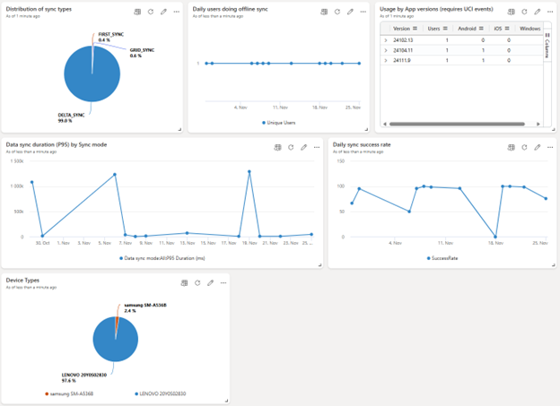

# Field Service Analytics

### This serves as a repository for Analytics implementation assets for Field Service

## Operational monitoring
### Field Service Mobile Offline Analytics Telemetry Dashboard
Azure Data Explorer Dashboard sample (dashboard-Field Service Mobile Offline.json) that demonstrates the information that is able to be queried within the Field Service Mobile Offline Telemetry export into your own Azure Applicatin Insights resources. This dashboard is focused on the usage on Mobile offline synchroniziation and can be used to understand usage, diagnose performance issues and understand synchronization issues.

This dashboard shows a summary of recent offline synchronizations
-	Distribution of sync types
-	Daily users doing offline sync
-	Usage by App versions
-	Data sync duration (P95) by Sync Mode
-	Daily sync success rate

## Steps to import the sample dashboard:
  1. Import the file "dashboard-Field Service Mobile Offline.json".
  
  

  2. Name the dashboard appropriately and then click to select datasources
  
  

  
  3. In the Datasource selection pane you have to put your Azure Application Insights subscriptionID in the placeholder .
  
  

  

  4. After updating the correct subscriptionID. click on connect.

  5. You will get a list of databases. Select your ApplicationInsights name from that list and save changes.

  6. your dashboard should have data now. Feel free to edit the queries to suit your needs. 
