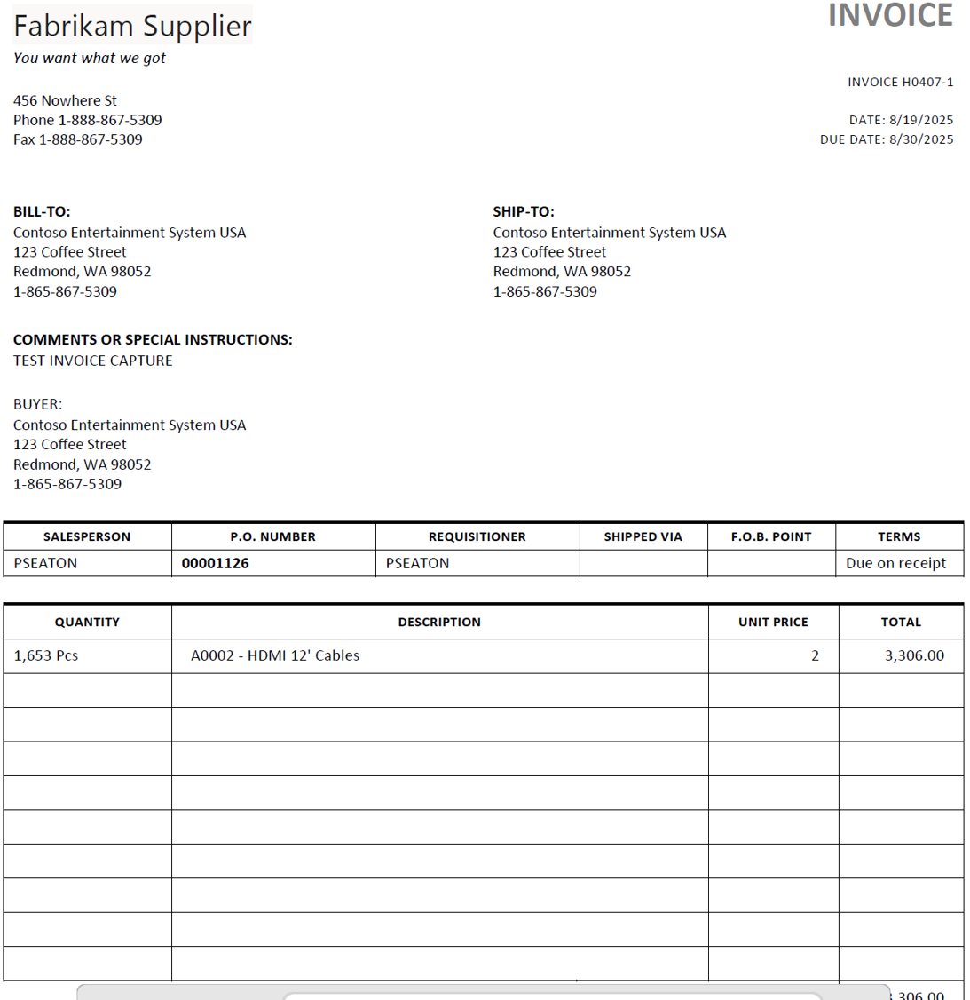
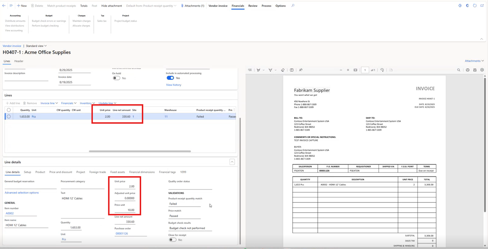
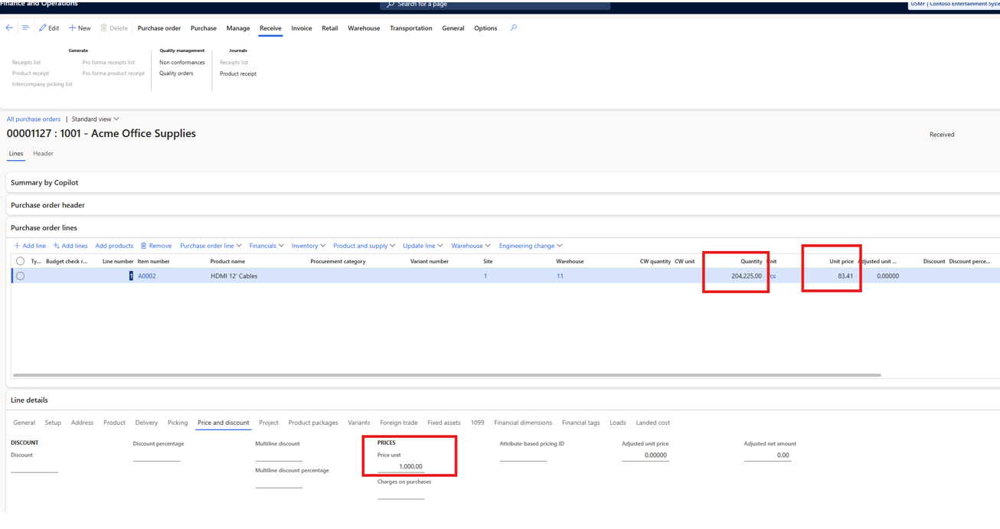
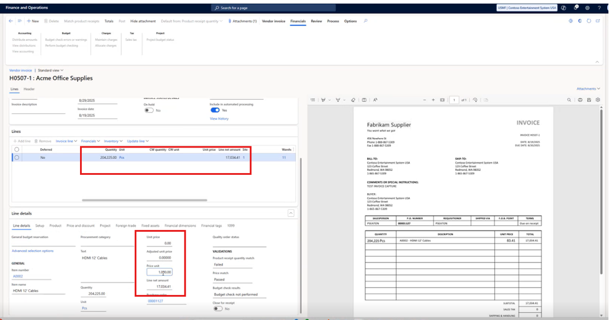

# Handling of PriceUnit with OCR invoice capture
In Dynamics 365 Finance and Operations, we have out of the box capability to use PriceUnit. "Price unit" indicates how many units the price is for, which is useful for items with high decimal precision in their unit price, such as liquid, fuel etc. 

If you are using Dynamics 365 OCR invoice capture solution, it doesn't recognize "Price unit" that results into inaccurate line net amount for purchase invoice lines.

# Scenarios
Purchase order use "Price unit". There can be one of the two scenarios where-in vendor sends PO invoice:
* Scenario 1: Vendor sends actual unit price e.g. $2 (after converting) as per below example, when OCR transfers pending vendor invoice into Finance and operation, that’s where it calculates wrong invoice net amount in pending vendor invoice.
  
| Scenario | PO Qty | PO Unit price | PO Price unit | PO Net amount (Qty*unit price/price unit) | OCR Invoice Qty | OCR Unit price | OCR Invoice net amount | F&O pending vendor invoice Unit price | F&O pending vendor invoice Price unit | F&O pending vendor invoice Net amount |
| :------- | :------: | -------: |  :------: | :------: | :------: |  :------: | :------: | :------: |  :------: |:------: |
| Scenario 1 | 1653 | 20 | 10 | 3306 | 1653 | 2 | 3306 | 2 | 10 | <code style="color : red">300</code> *This is wrong |

Purchase order with Price unit:


Vendor invoice with actual unit price (after converting)


Pending vendor invoice through OCR Invoice capture


OCR brings the invoice as pending vendor invoice. Finance and Operations logic defaults Price unit, OCR assumes unit price * qty = net amount, how-ever, Finance and Operations logic considers Price unit and therefore wrong net amount on invoice.

* Scenario 2: Vendor sends same unit price e.g. 83.41 (as PO price unit), when OCR transfer pending vendor invoice into Finance and operations, that’s where it doesn’t bring unit price in pending vendor invoice. 

| Scenario | PO Qty | PO Unit price | PO Price unit | PO Net amount (Qty*unit price/price unit) | OCR Invoice Qty | OCR Unit price | OCR Invoice net amount | F&O pending vendor invoice Unit price | F&O pending vendor invoice Price unit | F&O pending vendor invoice Net amount |
| :------- | :------: | -------: |  :------: | :------: | :------: |  :------: | :------: | :------: |  :------: |:------: |
| Scenario 2 | 10000 | 83.41 | 1000 | 830.41 | 10000 | 83.41 | 830.41 | <code style="color : red">0</code> *This is wrong | 1000 | 830.41 |

Purchase order with Price unit:


Vendor invoice with actual unit price (after converting)


Pending vendor invoice through OCR Invoice capture


OCR brings the invoice as pending vendor invoice. Finance and Operations logic defaults Price unit, OCR assumes unit price * qty <> net amount, and it doesn’t populate unit price.

# Extension:
This is known product gap with Dynamics 365 OCR Invoice capture solution. How-ever, this can be solved by placing small X++ extension in Finance and Operations. After looking at the code, we can use COC (chain of command) once OCR transfer invoice into F&O. 

Create a new class e.g. VendInvoiceCapInvDataUpdateHandlerSA_Extension as below.
```
using Newtonsoft.Json.Linq;
[ExtensionOf(classstr(VendInvoiceCapInvDataUpdateHandler))]
Public final class VendInvoiceCapInvDataUpdateHandlerSA_Extension
{
    private static real myGetRealFromJObjectValue(JObject jObject)
    {
        JObject nestedObject = jObject.GetValue('Value') as JObject;
        if (nestedObject != null)
        {
            return nestedObject.GetValue('Value');
        }
        else
        {
            return jObject.GetValue('Value');
        }
    }
 
    public static void updateInvoiceLine(VendorInvoiceLineEntity _line, JArray _attributes, CapturedInvoiceType _invoiceType)
    {
        PurchLine     purchLine;
        PriceUnit     priceUnit, priceUnitlc;
        AmountCur     lineAmount, lineAmountCur, lineAmountlc;
        PurchQty      purchQty;
 
        next updateInvoiceLine(_line,_attributes,_invoiceType);
 
        select firstonly1 purchLine where purchLine.PurchId == _line.PurchaseOrder
                    && purchLine.LineNumber == _line.LineNumber
                    && purchLine.ItemId == _line.ItemNumber;
 
        if (_invoiceType == CapturedInvoiceType::POInvoice && CapturedInvoiceParameters::find().SApriceControl == NoYes::Yes)
        {
            System.Collections.IEnumerator iterator = _attributes.GetEnumerator();
            while (iterator.MoveNext())
            {
                JObject attribute = iterator.Current;
                str propName   = attribute.GetValue('Key').ToString();
 
                switch (propName)
                {
                    case "vis_unitprice":
                        priceUnit = VendInvoiceCapInvDataUpdateHandler::myGetRealFromJObjectValue(attribute);
                        break;
                    case "vis_quantity":
                        purchQty = VendInvoiceCapInvDataUpdateHandler::myGetRealFromJObjectValue(attribute);
                        break;
                    case "vis_amount":
                        lineAmount = VendInvoiceCapInvDataUpdateHandler::myGetRealFromJObjectValue(attribute);
                        break;
                }
            }
            if (priceUnit && purchQty && lineAmount && _line.PriceUnit > 1)
            {
                if (priceUnit*purchQty > lineAmount)
                {
                    _line.UnitPrice = (lineAmount/purchQty)*_line.PriceUnit;
                }
            }
            if (priceUnit && purchQty && !lineAmount && _line.PriceUnit > 1)
            {
                    _line.UnitPrice = _line.UnitPrice * _line.PriceUnit;
            }
            if (purchQty && lineAmount && !priceUnit && _line.PriceUnit > 1)
            {
                lineAmountCur = lineAmount/_line.PriceUnit;
                lineAmount = purchLine.LineAmount;
                if (lineAmountCur == purchLine.LineAmount)
                {
                    _line.UnitPrice = lineAmountCur*purchQty/_line.PriceUnit;
                }
            }
 
           _line.update();
        }
    }
 }
```
# Considerations:
* Look only for PO invoice (not invoice journal)
* Only look for PO invoice line where price multiplier was used on the related PO line
* Get unit price, Qty and Amount from OCR
* If price unit is used, then update unit price on pending vendor invoice line and recalc pending vendor net amount.

# Results:
*	After putting this extension, it populates right unit price and recalc net amount based on invoice qty.

