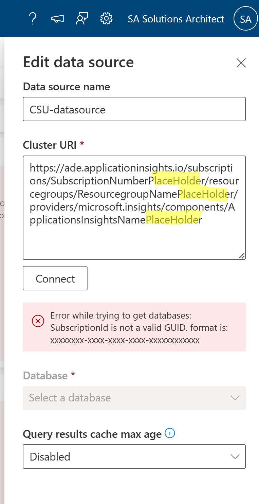

# Operational Insights

Operational Insights is a Dynamics 365 Commerce feature that's designed to give customers better visibility into their service health and business functionality by sending telemetry directly to a customer-owned Application Insights account.

By enabling Operational Insights for your environments in Commerce headquarters, you can collect a curated list of events from both Commerce Scale Unit (CSU) and your point-of-sale (POS) devices. These events can help you better understand how your systems are performing, and they let you monitor key technical and business metrics.

Even if you don't want to collect this telemetry all the time, you can benefit by quickly enabling or disabling collection for specific environments. In this way, the telemetry can help you troubleshoot or debug during development or in production.

## Enable the feature

Please follow the detailed steps in the learn article to enable the feature and setup the App Insights instance to collect diagnostic event logs for your Dynamics 365 Commerce environments. [Set up Operational Insights](https://learn.microsoft.com/en-us/dynamics365/commerce/dev-itpro/operational-insights)

This article also lists some useful assets that compliment an upcoming TechTalk on the Operational Insights feature.
<Replace with Link to TT here>

## Whitepaper

First is the whitepaper with a number of useful queries to help troubleshoot issues directly in App Insights. The whitepaper describes the events and schemas that are planned for the first release of Operational Insights for POS. [Download the whitepaper](https://download.microsoft.com/download/9/2/b/92be35b0-0e24-4a4d-940d-6f4db29791c0/Operational-Insights-Commerce-POS-events-queries.pdf)

## Sample dashboard

Second asset is a sample dashboard with built-in queries that can give you a snapshot of solution health. This is handy as you do not need to manually run queries to seek information. The dashboard is enabled via an instance of Azure Data Explorer that takes the telemetry data feeds from your configured App Insights instance.

  
  
### Steps to import the sample dashboard:
  1. Import the file "dashboard-CSU Overview Sample".
  
  

  2. Name the dashboard appropriately.
  
   
  
  
  3. Click to select datasources. 
  
   
  
  4. There is a templatised datasource with dummy placeholders. You need to replace with your Azure subscription, resource group and App Insights instance.
  
    
    
    
  
