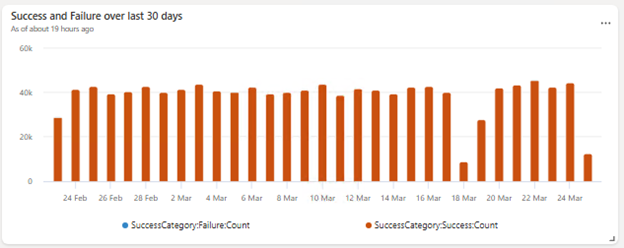
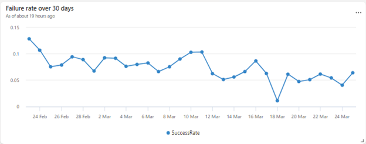
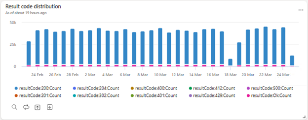

# Web Requests Dashboard Tiles - Dataverse

## Tile 1: Success and Failure Over the Last 30 Days

### Description
This bar chart provides a comprehensive daily overview of all inbound and outbound web requests captured in Dataverse, clearly distinguishing between successful and failed requests.

<div align=center></div>

### Query
```kql
requests
| where timestamp >= ago(30d)
| extend SuccessCategory = iif(success == true, "Success", "Failure")
| summarize Count = count() by bin(timestamp, 1d), SuccessCategory
| render columnchart
```

### Usage
- Quickly identify spikes in failures, indicating potential outages or issues.
- Use this data to create alerts for increases in failure counts above a threshold.

### Alert Example
Set an alert to trigger when the daily failure count exceeds a specific threshold.

---

## Tile 2: Performance Buckets

### Description
This tile categorizes all Dataverse web requests into performance buckets based on their response times, highlighting the overall response time distribution and trends over time. For example, web requests executing in less than 250 milliseconds is one bucket and web requests taking between 15 seconds to 30 seconds is another bucket. You can clearly identify trends over days.

<div align=center></div>

### Query
```kql
requests
| where timestamp >= ago(30d)
| summarize Count = count() by bin(timestamp, 1d), performanceBucket
| render columnchart
```

### Usage
- Identify performance degradation by monitoring shifts between buckets.
- Create alerts if requests in slower performance buckets increase beyond typical patterns.

### Alert Example
Create an alert when the percentage of requests in slow buckets (e.g., >5sec) exceeds the normal pattern.

---

## Tile 3: Success Rate Over 30 Days

### Description
A line chart visualizing the daily success rate trends of all web requests, helping you quickly assess the reliability of your Dataverse endpoints.

<div align=center></div>

### Query
```kql
requests
| where timestamp >= ago(30d)
| summarize SuccessCount = countif(success == true), TotalCount = count() by bin(timestamp, 1d)
| extend SuccessRate = todouble(SuccessCount) / todouble(TotalCount) * 100
| render timechart
```

### Usage
- Spot declining trends early and intervene proactively.
- Generate alerts when the success rate dips below acceptable levels.

### Alert Example
Trigger an alert if the success rate falls below 99.8%.

---

## Tile 4: Failure Rate Over 30 Days

### Description
Tracks the daily percentage of failed requests in Dataverse, making it easy to monitor the stability of your web services and promptly identify potential issues. This is an inverse of the success rate. You can choose based on which one gives you better insights.

<div align=center></div>

### Query
```kql
requests
| where timestamp >= ago(30d)
| summarize SuccessCount = countif(success != true), TotalCount = count() by bin(timestamp, 1d)
| extend SuccessRate = todouble(SuccessCount) / todouble(TotalCount) * 100
| render timechart
```

### Usage
- Quickly recognize abnormal spikes in failure rates.
- Use alerts to automatically notify your team of unusual failure rate increases.
- If failure rates are high, you can go to Azure Application Insights to get details on the failures and identify specific reasons in the logs.

### Alert Example
Set an alert when failure rate surpasses 0.1%.

---

## Tile 5: Web API Performance Over Last 3 Weeks

### Description
Tabular data showing the detailed performance metrics (P99, P95, P75, P50, etc.) for key Dataverse API endpoints, enabling precise tracking of API response times for different APIs.

<div align=center></div>

### Query
```kql
let W0 = requests
| where timestamp >= startofweek(ago(7d)) and timestamp < startofweek(now())
| where isnotempty(operation_Name) and trim(" ", operation_Name) != "" 
       and not(operation_Name matches regex "^[0-9a-fA-F-]{36}$")
| summarize 
    P99_W0 = percentile(duration, 99),
    P95_W0 = percentile(duration, 95),
    P75_W0 = percentile(duration, 75),
    P50_W0 = percentile(duration, 50) 
    by operation_Name;
let W1 = requests
| where timestamp >= startofweek(ago(14d)) and timestamp < startofweek(ago(7d))
| where isnotempty(operation_Name) and trim(" ", operation_Name) != "" 
       and not(operation_Name matches regex "^[0-9a-fA-F-]{36}$")
| summarize 
    P99_W1 = percentile(duration, 99),
    P95_W1 = percentile(duration, 95),
    P75_W1 = percentile(duration, 75),
    P50_W1 = percentile(duration, 50) 
    by operation_Name;
let W2 = requests
| where timestamp >= startofweek(ago(21d)) and timestamp < startofweek(ago(14d))
| where isnotempty(operation_Name) and trim(" ", operation_Name) != "" 
       and not(operation_Name matches regex "^[0-9a-fA-F-]{36}$")
| summarize 
    P99_W2 = percentile(duration, 99),
    P95_W2 = percentile(duration, 95),
    P75_W2 = percentile(duration, 75),
    P50_W2 = percentile(duration, 50) 
    by operation_Name;
W0
| join kind=fullouter (W1) on operation_Name
| join kind=fullouter (W2) on operation_Name
| where isnotempty(operation_Name) and trim(" ", operation_Name) != ""  
| project operation_Name, 
    P99_W0, P99_W1, P99_W2,
    P95_W0, P95_W1, P95_W2,
    P75_W0, P75_W1, P75_W2,
    P50_W0, P50_W1, P50_W2
| order by operation_Name asc
```

### Usage
- Compare endpoint performance across various percentiles.
- Quickly isolate endpoints with degraded performance.
- Use percentile data to establish SLOs (Service Level Objectives).

### Alert Example
Set up alerts if the 99th percentile latency for critical APIs exceeds a defined threshold.

---

## Tile 6: Result Code Distribution

### Description
Displays the daily distribution of HTTP result codes for all inbound and outbound web requests in Dataverse, helping you quickly diagnose and respond to HTTP errors (e.g., 5xx or 4xx).

<div align=center></div>

### Query
```kql
requests
| where timestamp >= ago(30d)
| summarize Count = count() by bin(timestamp, 1d), resultCode
| order by timestamp asc
```

### Usage
- Identify and troubleshoot issues based on HTTP status code spikes.
- Set alerts for abnormal increases in specific HTTP status codes.

### Alert Example
Create alerts when the count of HTTP 5xx errors exceeds typical limits.