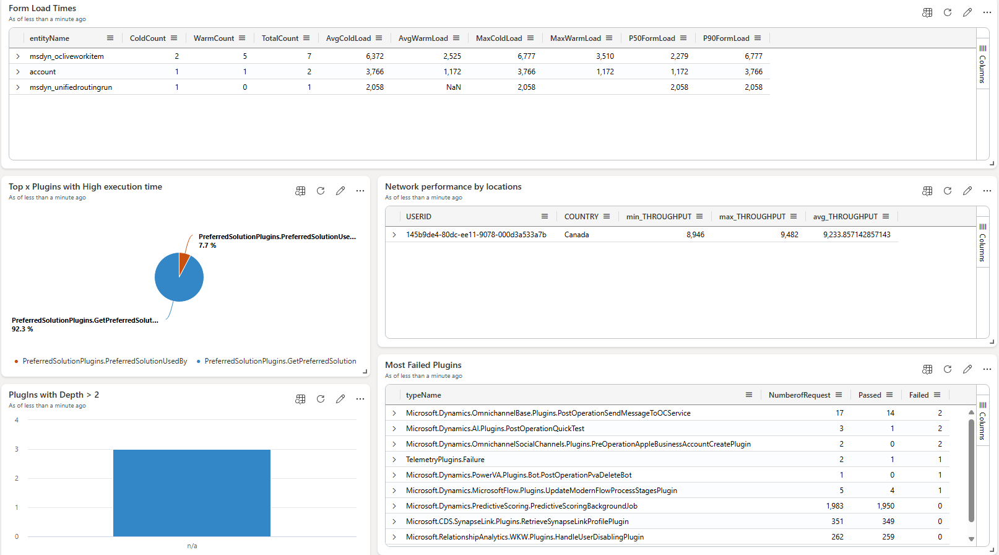

# Form Load and Plugin Dashboard
This dashboard shows information about Form load duration for different forms and Plugin Execution Insights. Using this dashboard, it is possible to identify:
- Load times for forms (p90, p50, Average load, warmload etc..). 
- Top x plugins with High esecution times
- Network Performance for different locations
- Most Failed plugins
- Plugins with depth > 2

# Web Requests Dashboard
This dashboard shows information about Different web requests stastics. Using this dashboard, it is possible to identify:
- Last 3 weeks percentiles for web requests (p90, p50, Average load, warmload etc..). 
- Success and failurs
- Result code distribution
- Daily web request performance buckets
- success rates

You can utilize the queries in these dashboards to set up alerts.

## Dashboard overview

## Steps to import the sample dashboard:
  1. Import the file "dashboard-CSAppInsights.json".
  
  

  2. Name the dashboard appropriately and then click to select datasources
  
  

  
  3. In the Datasource selection pane you have to put your Azure Application Insights subscriptionID in the placeholder .
  
  

  

  4. After updating the correct subscriptionID. click on connect.

  5. You will get a list of databases. Select your ApplicationInsights name from that list and save changes.

  6. your dashboard should have data now. Feel free to edit the queries to suit your needs. 
