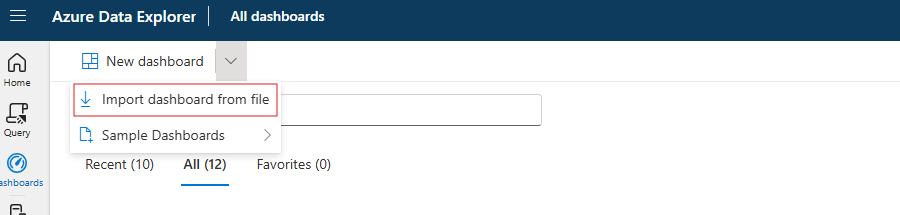
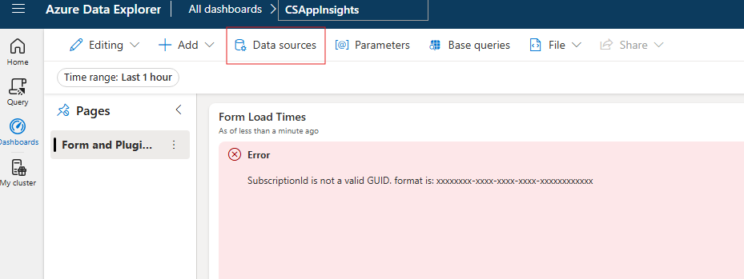
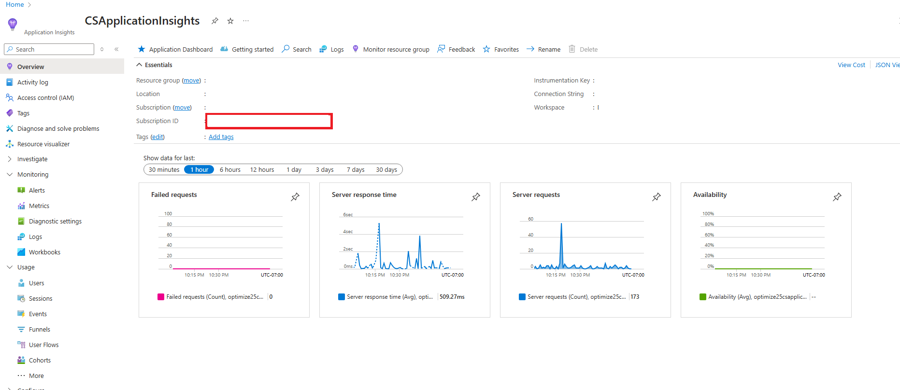
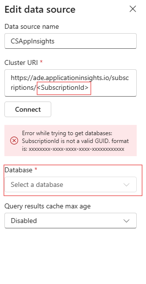

# Dataverse Query Throttling — ADX/AI Logs Dashboard

A ready-to-use Azure Data Explorer (ADX) / Application Insights dashboard that visualizes **Dataverse Query Throttling** so you can spot hot windows, find the noisiest queries, understand reasons, and prioritize fixes.

---

## What you’ll see (Tiles)

1. **Throttles Over Time + Avg Delay** – trend of throttled queries with average delay.  
2. **Top Throttled Queries (by Hash)** – the worst offenders with a sample command text.  
3. **Reasons for Throttling** – distribution of throttle reasons.  
4. **Delay Percentiles** – P50/P90/P95/P99 to understand user impact.  
5. **Hot Windows (Spike Detection)** – statistically significant spikes.  
6. **Most-Affected Callers/Operations** – users/operations hit hardest.  
7. **Recent Samples** – last 100 throttling records for fast triage.  
8. **Environment/Org Breakdown** – multi-tenant view (optional).

---

## Prerequisites

- Application Insights logs that include the **Query Throttling** signal (commonly in `traces` or `customEvents`).
- Access to ADX / Log Analytics / Workbooks to run KQL.
- Permissions to create a dashboard/workbook.

---

## Dashboard overview

<div align=center></div>


## Steps to import the sample dashboard:
  1. Import the file "dashboard-Dataverse Throttling Dashboard.json".
  
  <div align=center></div>

  2. Name the dashboard appropriately and then click to select datasources
  
  <div align=center></div>
  
  3. In the Datasource selection pane you have to put your Azure Application Insights subscriptionID in the placeholder .
  
  <div align=center></div>
  <div align=center></div>

  4. After updating the correct subscriptionID. click on connect.

  5. You will get a list of databases. Select your ApplicationInsights name from that list and save changes.

  6. your dashboard should have data now. Feel free to edit the queries to suit your needs. 


## Shared Parameters & Helper

Add these **once** to your dashboard/workbook. All tile queries assume the same `_lookback`, `_bin`, and helper.

> If you already created a **view/table** named `DataverseThrottle`, use that directly in the tiles and **remove the `()`** call.

```kusto
// ------ Global Parameters ------
let _lookback = 7d;     // time window for analysis (adjust as needed)
let _bin      = 1h;     // chart bin size (e.g., 10m, 30m, 1h)

// ------ Helper Function ------
// Flattens throttling signals from traces/customEvents and exposes common fields.
// If you prefer a view/table instead of a function, materialize this query as a view
// and then reference DataverseThrottle (no parentheses) in the tiles.
let DataverseThrottle = () {
    union isfuzzy=true
    (
        traces
        | where timestamp > ago(_lookback)
        | where tostring(customDimensions.throttlingAction) =~ "Throttle"
           or tostring(customDimensions.ThrottleAction) =~ "Throttle"
    ),
    (
        customEvents
        | where timestamp > ago(_lookback)
        | where name =~ "QueryThrottled"
           or tostring(customDimensions.throttlingAction) =~ "Throttle"
    )
    | extend cd = todynamic(customDimensions)
    | extend
        command       = tostring(cd.Command),
        cdsQueryHash  = tostring(cd.CdsQueryHash),
        delayMs       = tolong(cd.throttlingDelayMilliseconds),
        probability   = todouble(cd.throttleProbabilityPercentage),
        reason        = tostring(cd.throttleReason),
        expiryTime    = todatetime(cd.throttleExpiryTime),
        environmentId = tostring(cd.environmentId),
        organization  = tostring(cd.organizationUrl),
        userId        = tostring(user_Id),
        opId          = tostring(operation_Id),
        opName        = tostring(operation_Name),
        sessionId     = tostring(session_Id)
    | project timestamp, command, cdsQueryHash, delayMs, probability, reason, expiryTime,
              environmentId, organization, userId, opId, opName, sessionId, itemType
};
```

---

## Tile 1 — Throttles Over Time (with Avg Delay)

### Description
A time series of **how many queries were throttled** and the **average delay (ms)** per time bin. This reveals trends, seasonality, and whether fixes are working.

### How to read
- Rising **Throttles** = more frequent throttling.
- Rising **AvgDelayMs** = more severe throttling impact.
- After optimizations, both should trend down.

### Kusto Query
```kusto
DataverseThrottle
| summarize Throttles = count(), AvgDelayMs = avg(delayMs) by bin(timestamp, _bin)
| order by timestamp asc
```

### Visualization
Time chart (line/area). Consider secondary Y-axis for `AvgDelayMs` if supported.

---

## Tile 2 — Top Throttled Queries (by Hash) + Sample Command

### Description
The **worst-offending queries** by stable hash (`cdsQueryHash`), along with a sample `command` and average delay.

### How to read
- Start remediation with the **top hashes** (highest `Throttles`).
- Use `AnySampleCommand` to locate and optimize the offending query.

### Kusto Query
```kusto
DataverseThrottle
| summarize Throttles = count(),
          AvgDelayMs = round(avg(delayMs), 1),
          AnySampleCommand = take_any(command)
  by cdsQueryHash
| top 15 by Throttles desc
```

### Visualization
Bar or Table.

---

## Tile 3 — Reasons for Throttling

### Description
Distribution of **throttle reasons** to explain *why* the platform throttled requests (e.g., concurrency, cost).

### How to read
- Dominant reasons reveal primary bottlenecks to target.

### Kusto Query
```kusto
DataverseThrottle
| summarize Throttles = count() by tostring(reason)
| top 10 by Throttles desc
```

### Visualization
Pie or Bar.

---

## Tile 4 — Delay Percentiles

### Description
Robust stats on **throttle delay**—`P50/P90/P95/P99`—to understand typical vs. tail-end impact on users.

### How to read
- High **P95/P99** means a small portion of requests suffer large delays, even if the median looks fine.

### Kusto Query
```kusto
DataverseThrottle
| summarize
    MinDelayMs = min(delayMs),
    P50DelayMs = percentile(delayMs, 50),
    P90DelayMs = percentile(delayMs, 90),
    P95DelayMs = percentile(delayMs, 95),
    P99DelayMs = percentile(delayMs, 99),
    MaxDelayMs = max(delayMs)
```

### Visualization
Single-value tiles or a compact table.

---

## Tile 5 — Hot Windows (Spike Detection)

### Description
Automatically highlights **time bins** where throttling **spiked** relative to a short-term baseline. Uses a 7-bin simple moving average implemented with `prev()` (cluster-agnostic).

### How to read
- Each row is a **spike timestamp**; drill into that period using other tiles for RCA (top hashes, reasons, callers).

### Kusto Query
```kusto
let _multiplier = 2.0;  // spike sensitivity: current > 2x baseline
let _minCount   = 5;    // ignore tiny blips
DataverseThrottle
| summarize Throttles = count() by timestamp = bin(timestamp, _bin)
| order by timestamp asc
| serialize
| extend p1 = prev(Throttles,1), p2 = prev(Throttles,2), p3 = prev(Throttles,3),
         p4 = prev(Throttles,4), p5 = prev(Throttles,5), p6 = prev(Throttles,6)
| where isnotnull(p6)   // ensure a full 7-point window
| extend MovingAvg = (todouble(Throttles)+todouble(p1)+todouble(p2)+todouble(p3)+todouble(p4)+todouble(p5)+todouble(p6)) / 7.0
| where Throttles > _multiplier * MovingAvg and Throttles > _minCount
| project timestamp, Throttles, MovingAvg
```

### Visualization
Table or time chart showing spike timestamps.

### Tuning
- Increase `_multiplier` or `_minCount` to reduce noise.
- Decrease `_bin` (e.g., 10m) to catch faster bursts.

---

## Tile 6 — Most-Affected Callers / Operations

### Description
Which **user IDs**, **operations**, or **sessions** are most frequently throttled, plus average delay per caller.

### How to read
- Focus remediation where **Throttles** are highest and **AvgDelayMs** is large.

### Kusto Query
```kusto
DataverseThrottle
| summarize Throttles = count(), AvgDelayMs = avg(delayMs)
  by Caller = coalesce(userId, opName, sessionId)
| top 15 by Throttles desc
```

### Visualization
Bar or Table.

### Tips
- Adjust the `coalesce` order to prioritize the most stable identifier in your tenant.

---

## Tile 7 — Recent Detailed Samples

### Description
A triage table of the latest throttling records: reason, delay, throttle expiry, and a command snippet.

### How to read
- Use `Command` to locate the query quickly.
- `expiryTime` indicates when throttling pressure should subside.

### Kusto Query
```kusto
DataverseThrottle
| project timestamp, reason, delayMs, probability, expiryTime,
          opId, opName, userId,
          Command = substring(command, 0, 800)
| order by timestamp desc
| take 100
```

### Visualization
Table (sorted by time descending).

---

## Tile 8 — Environment / Org Breakdown (Optional)

### Description
For multi-tenant teams, where throttling concentrates across **environments** and **org URLs**.

### How to read
- High concentrations in specific envs/orgs point to localized workload or configuration issues.

### Kusto Query
```kusto
DataverseThrottle
| summarize Throttles = count(), AvgDelayMs = avg(delayMs)
  by tostring(environmentId), tostring(organization)
| top 20 by Throttles desc
```

### Visualization
Bar or Table.

---

## Interpreting the Whole Dashboard

- **Reduce query cost:** fetch only needed columns, add filters, avoid expensive joins, paginate results.  
- **Reschedule heavy jobs:** move reports/exports to off-peak hours.  
- **Cache repeated reads:** use an app/service cache for hotspots.  
- **Work the list methodically:**  
  1) Start with **Tile 2** (top hashes),  
  2) Check **Tile 3** (reasons),  
  3) Validate user impact via **Tile 4** (percentiles),  
  4) Monitor improvement in **Tile 1** (trend) and **Tile 5** (spikes).

---

