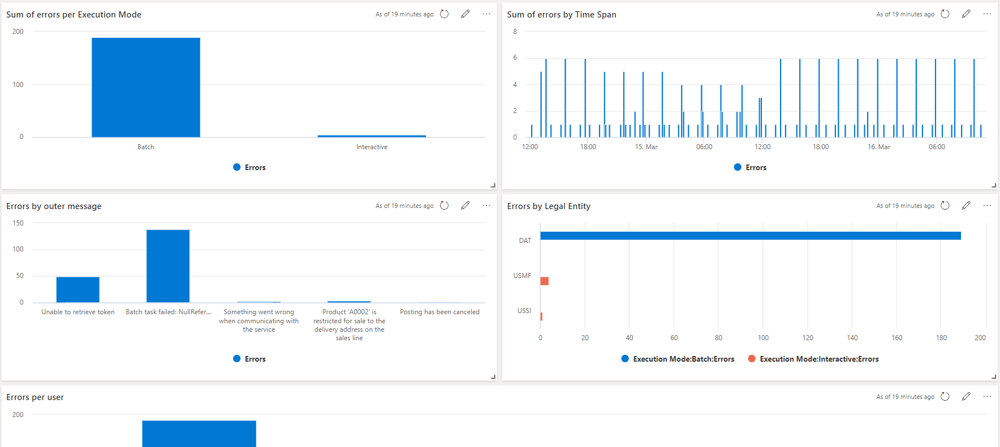
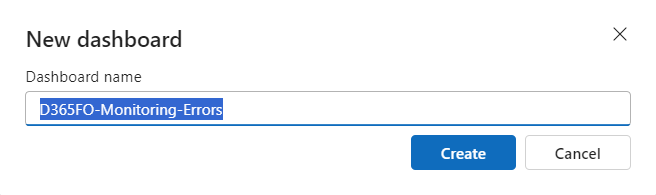

# Errors Telemetry dasboard
This dashboard shows information about errors that are reported by the environments. Using this dashboard, it is possible to:
- Investigate the nature and distributiion of the errors over time. 
- Review the errors in the envirionemnts
- Revire the source of errors, gruppong them by legal entity, reer type and users

## Dashboard overview

## Steps to import the sample dashboard:
  1. Import the file "dashboard-D365FO-Monitoring-Errors.json".
  
  

  2. Name the dashboard appropriately.
  
   

  
  3. Click to select datasources. 
  
  

  
  4. There is a templated datasource with dummy placeholders. You need to replace with your Azure subscription, resource group and Application Insights instance.
  
  

  

