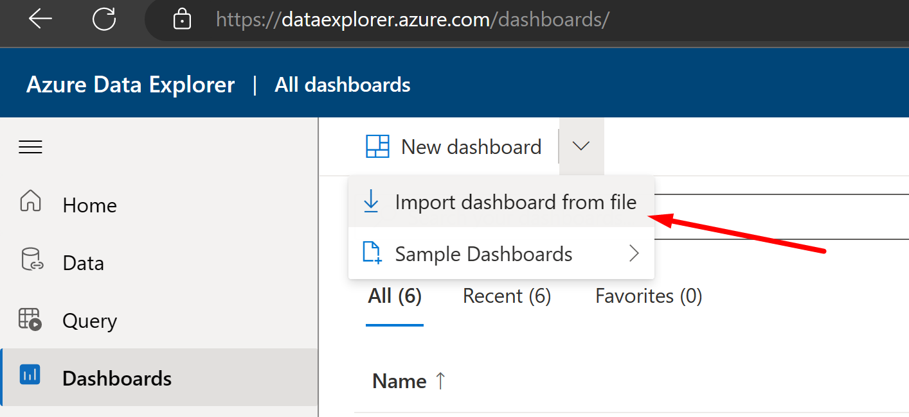
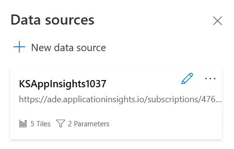

# Azure Data Explorer sample dashboards

| Dashboard  | Description  | Take me there (use CTRL+click to open in a new tab) |
| ------ | ------ | ------ |
| Slow queries | Slow queries reported by the AOS. | [Slow Queries](SlowQueries) |
| Order 2 Cash | Order to cash process telemetry. | |

## Steps to import the sample dashboard:
  1. Import the file (e.g "ADE-Dashboard-D365FO-Monitoring-SlowQueries.json").
  
  

  2. Name the dashboard appropriately.
  
   

  
  3. Click to select datasources. 
  
  

  
  4. There is a templated datasource with dummy placeholders. You need to replace with your Azure subscription, resource group and Application Insights instance.
  
  

  

