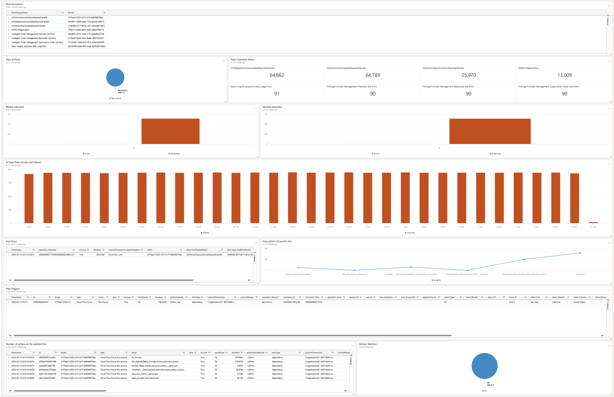

# Power Autmoate Monitoring Dashboard
This dashboard consists of two integrated pages. The first page, "Performance Monitoring," displays information about Power Automate executions, types of flows, weekly and monthly executions, failures, and exceptions in your environment.

The second page focuses on errors and exceptions in Power Automate runs, triggers, and actions.

Using this dashboard, you can identify:

- Flow executions
- Types of flows
- Flow execution status
- Weekly executions
- Monthly executions
- Flow success and failure rates
- Flow runs
- Flow actions in specific runs (select Run ID for that)
- Flow triggers
- Action statistics
- Most problematic flows
- Failed triggers
- Most problematic actions

## Dashboard overview

## Steps to import the sample dashboard:
  1. Import the file "dashboard-Power Automate Monitoring.json".
  
  

  2. Name the dashboard appropriately and then click to select datasources
  
  

  
  3. In the Datasource selection pane you have to put your Azure Application Insights subscriptionID in the placeholder .
  
  

  

  4. After updating the correct subscriptionID. click on connect.

  5. You will get a list of databases. Select your ApplicationInsights name from that list and save changes.

  6. your dashboard should have data now. Feel free to edit the queries to suit your needs. 
